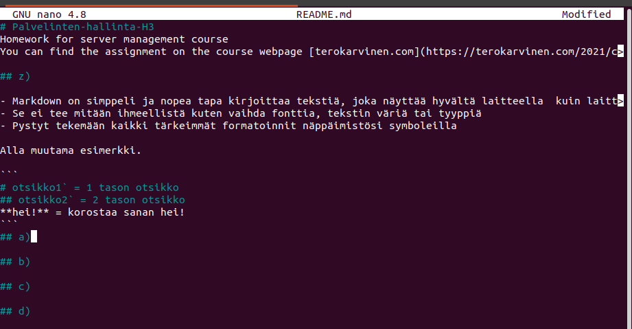

# Palvelinten-hallinta-H3
Homework for server management course
You can find the assignment on the course webpage [terokarvinen.com](https://terokarvinen.com/2021/configuration-management-systems-palvelinten-hallinta-ict4tn022-2021-autumn/)

## z)

- Markdown on simppeli ja nopea tapa kirjoittaa tekstiä, joka näyttää hyvältä laitteella  kuin laitteella
- Se ei tee mitään ihmeellistä kuten vaihda fonttia, tekstin väriä tai tyyppiä
- Pystyt tekemään kaikki tärkeimmät formatoinnit näppäimistösi symboleilla

Alla muutama esimerkki.

```
# otsikko1` = 1 tason otsikko
## otsikko2` = 2 tason otsikko
**hei!** = korostaa sanan hei!
```
## a)



## b)

## c)

## d)
