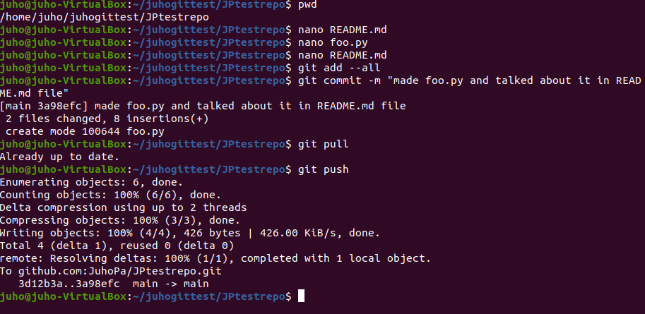
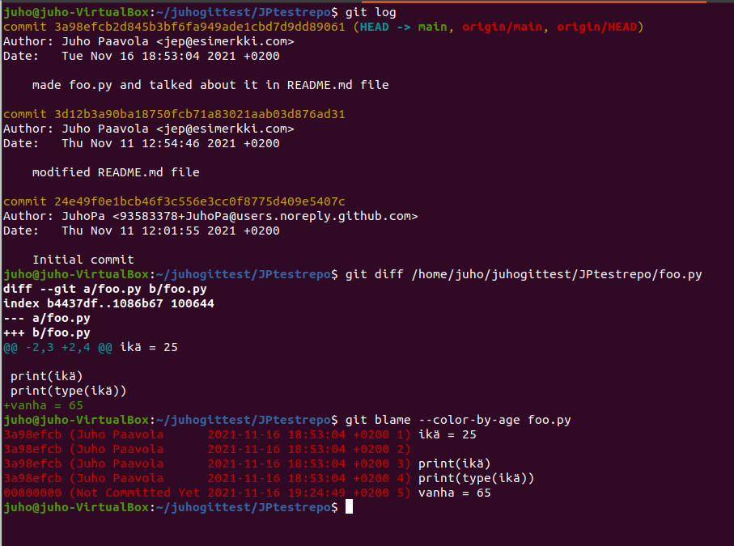
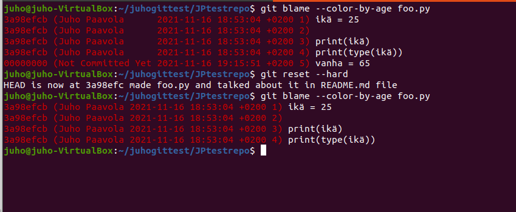
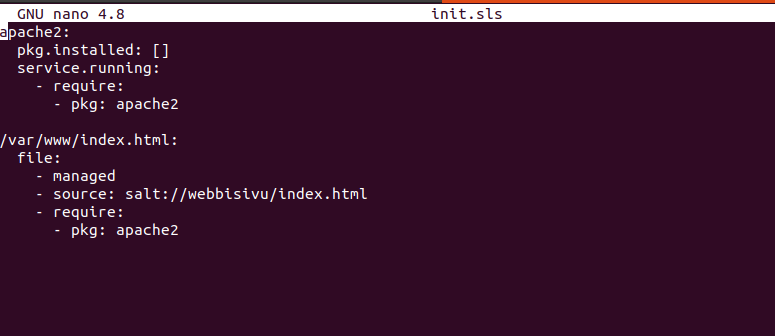
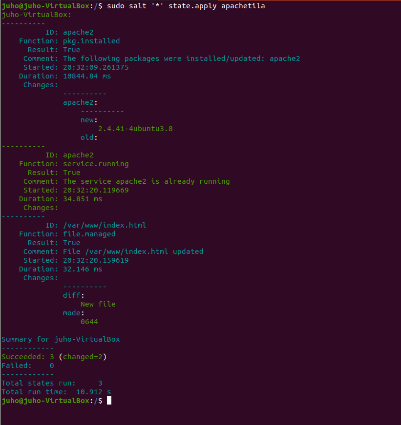

# Palvelinten-hallinta-H3
Homework for server management course
You can find the assignment on the course webpage [terokarvinen.com](https://terokarvinen.com/2021/configuration-management-systems-palvelinten-hallinta-ict4tn022-2021-autumn/)

## z)

- Markdown on simppeli ja nopea tapa kirjoittaa tekstiä, joka näyttää hyvältä laitteella  kuin laitteella
- Se ei tee mitään ihmeellistä kuten vaihda fonttia, tekstin väriä tai tyyppiä
- Pystyt tekemään kaikki tärkeimmät formatoinnit näppäimistösi symboleilla

Alla muutama esimerkki.

```
# otsikko1` = 1 tason otsikko
## otsikko2` = 2 tason otsikko
**hei!** = korostaa sanan hei!
```
## a)


## b)

Tein foo.py tiedoston ja muokkasin README.md tiedostoa ja sen jälkeen päivitin muutokset githubiin komennoilla

```
git add --all
git commit -m "made foo.py and talked about it in README.md file"
git pull
git push
```


**git log** komento näyttää kaikki commitit, kellonajan milloin ne on tehty ja annetun commit kuvauksen
**git diff /home/juho/juhogittest/JPtestrepo foo.py** näyttää tiedoston committed version ja muutokset joita on tehty sen jälkeen mutta ei ole vielä commitattu.
**git blame --color-by-age foo.py** näyttää kaikki kyseisen tiedoston rivit ja milloin ne on kirjoitettu. Kertoo myös jos tiedostossa on rivejä mitä ei ole commitattu.



## c)

Annoin komennon **git reset --hard** se palauttaa kaikki tiedostot edellisen commitin tilaan.
Alla olevassa kuvassa näkyy viimeinen rivi on kadonnut foo.py tiedostosta.



## d)

Tein hakemiston /srv/salt/apachetila ja sinne init.sls tiedoston



Ajoin tilan komennolla
```
sudo salt '*' state.apply apachetila
```


kuvasta nähdään, että 3 komentoa onnistui eli apache2 asennettiin ja se on käynnissä ja päivitettiin /var/www/index.html tiedoston sisältö

